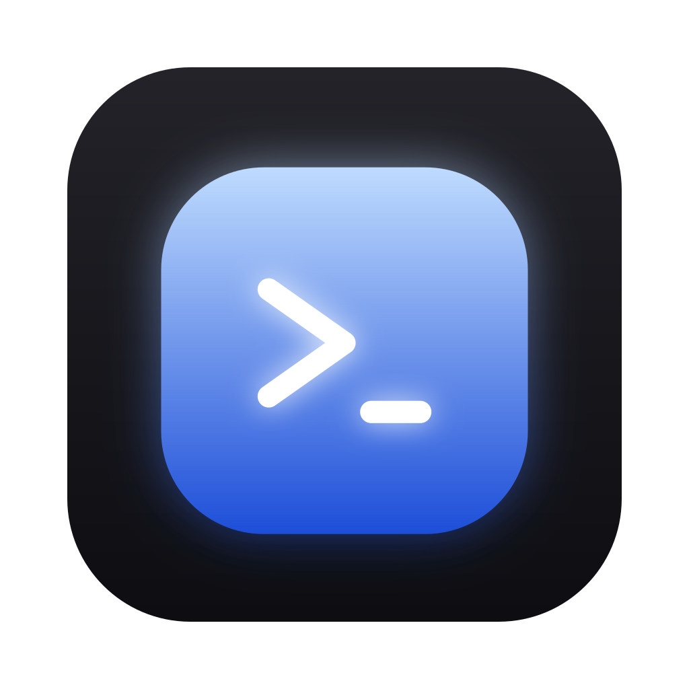

<div align="center">

<a href="https://terra-tools.github.io/terra/">
  
</a>

<h1>Terra</h1>

<p>
  <b>A terminal your agents can drive.</b><br>
  Browser-style tabs in a clean, dark window. Your coding agent opens tabs, types into them and reads them back — while you watch the same tabs live.
</p>

<p>
  <a href="https://terra-tools.github.io/terra/"></a>
  <a href="https://github.com/terra-tools/terra/releases"></a>
  
</p>

</div>

## Install

**[Download for your platform →](https://terra-tools.github.io/terra/#install)**

macOS and Linux, from a terminal:

```sh
curl -fsSL https://terra-tools.github.io/terra/install.sh | sh
```

Installers are on the [releases page](https://github.com/terra-tools/terra/releases)
too: `.dmg` on macOS, `-setup.exe` on Windows, `.deb` on Linux. Not signed yet —
macOS: right-click → Open on first launch; Windows: click through SmartScreen.

## Why

Agents run long commands somewhere you cannot see. Terra gives them a real
window instead: every command lands in a tab you can watch, scroll back and
take over at any moment. Nothing is hidden in a log file, and nothing needs a
second terminal multiplexer on top.

- **Tabs, not panes.** Titles, icons and `⌘1`–`⌘9`, the way a browser does it.
- **Driveable.** Anything on your machine can open a tab, send keystrokes and
  read the screen back.
- **Yours.** Free, open source and local — no account, no telemetry.

## Selecting text

Inside **tmux** (with `set -g mouse on`), a plain mouse drag works the way it
does in Ghostty: tmux makes the selection, and on release it copies it to the
macOS clipboard through OSC 52 — over `ssh` too, which is otherwise a one-way
street. Stock tmux needs no other configuration for this. Add
`set -s set-clipboard on` to your `tmux.conf` if you also want programs *inside*
tmux (vim, an agent) to reach the clipboard the same way.

Other programs that take the mouse — vim on its own, claude code, codex —
receive every click themselves and copy nothing back, so a plain drag inside one
selects nothing. Hold **⇧ Shift** (or **⌥ Option**) while dragging to select in
Terra itself, then `⌘C` to copy. That works in every program, tmux included.

## Splits and the mouse

Split the window (`⌘\`) and the pointer picks the pane: move the mouse into a
terminal and it takes the keyboard — no click first. A *resting* cursor never
does, so panes can split, resize and scroll under it without the keyboard
moving, and a drag that crosses into the neighbour stays with the pane it
started in. Set `focus_follows_mouse = false` under `[input]` in
`~/.terra/config.toml` for click-to-focus only.

The wheel always scrolls the pane you are pointing at, whether or not it holds
the keyboard — including inside a full-screen program that handles its own
scrolling.

## Docs

- [Using Terra with agents](docs/AGENTS.md) — the block to paste into your CLAUDE.md or AGENTS.md
- [Architecture](docs/ARCHITECTURE.md) — how the app, the CLI and the protocol fit together
- [Development](docs/DEVELOPMENT.md) — building, testing and packaging from source
- [Configuration](docs/config.example.toml) — the settings file in `~/.terra/config.toml`

## License

MIT
